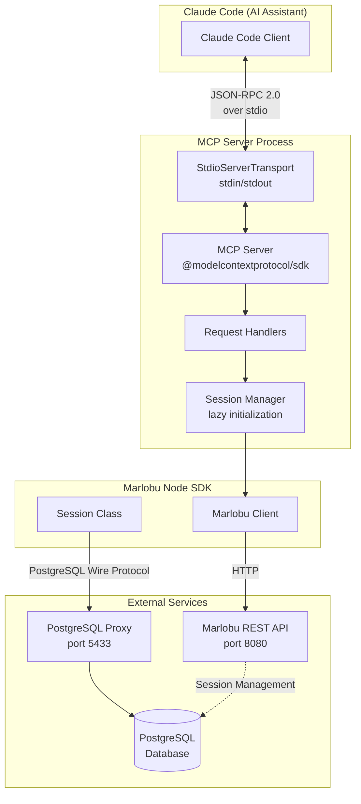
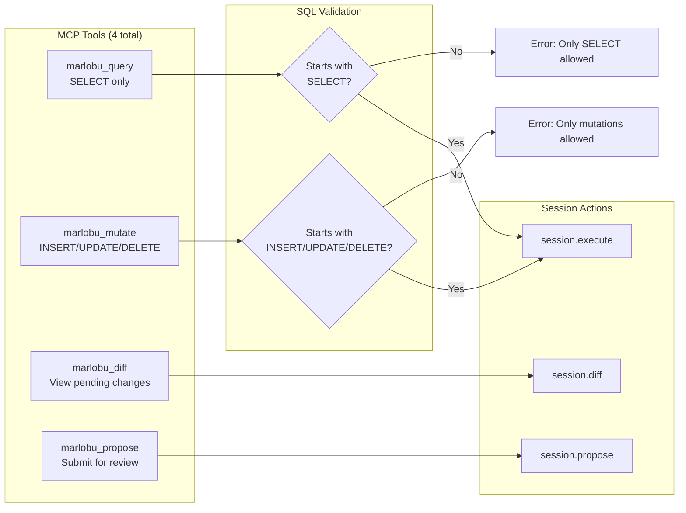
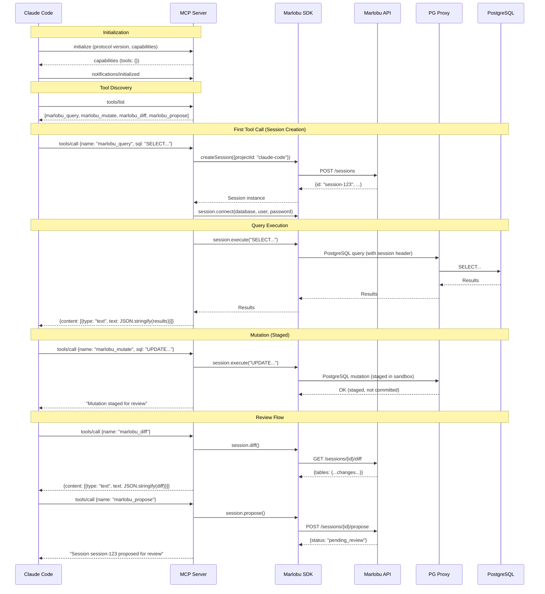
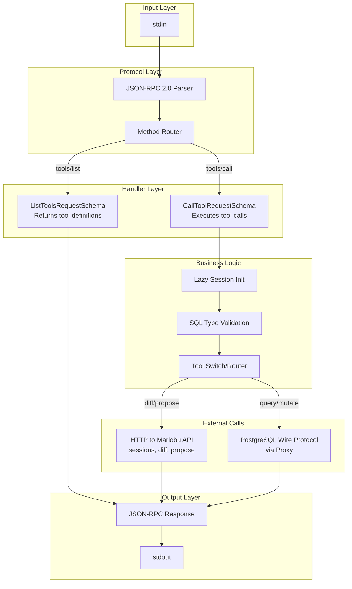
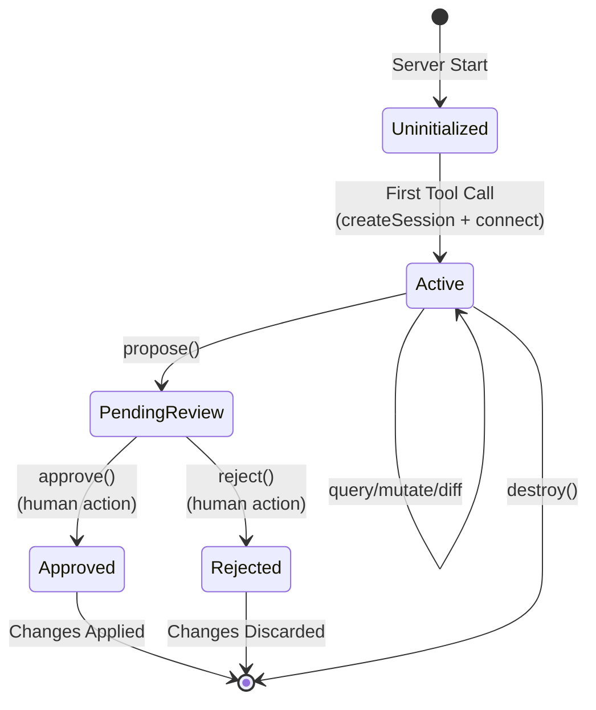
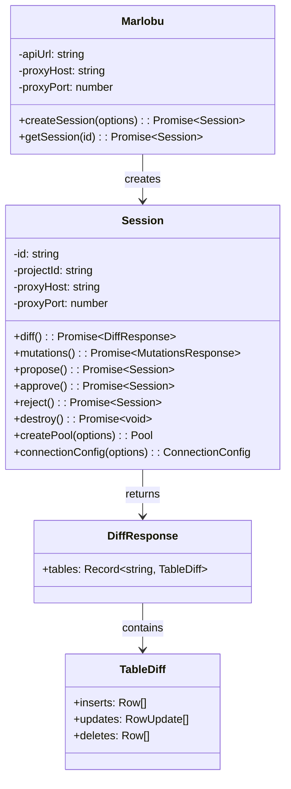
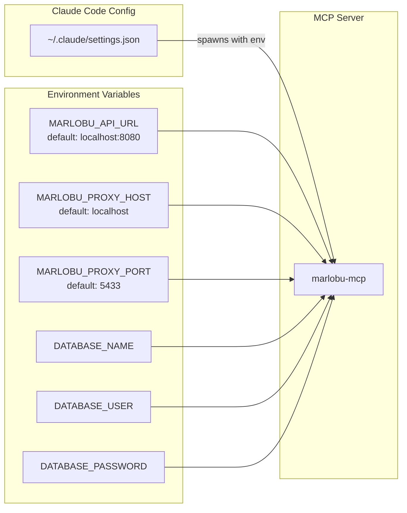
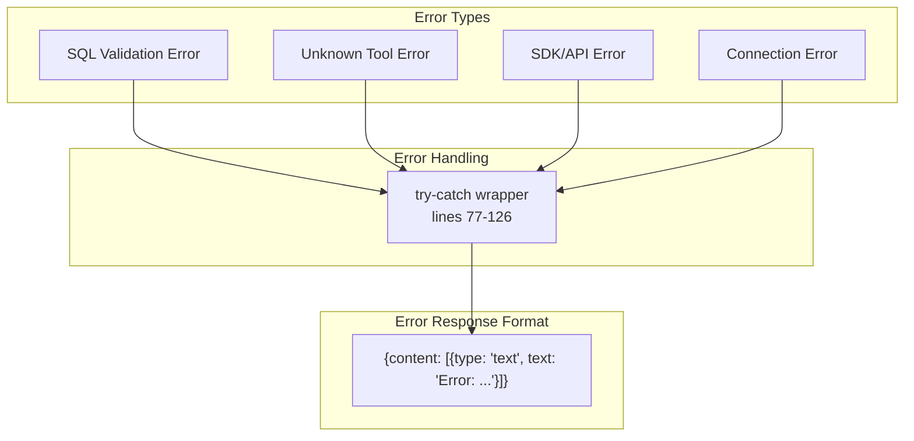

# Marlobu MCP Server Architecture

## Overview

The Marlobu MCP Server provides a Model Context Protocol interface for a PostgreSQL change staging and review system. It enables AI assistants (like Claude Code) to safely interact with databases by **staging changes for human review** rather than applying them directly.

---

## System Architecture



---

## Tool Definitions



---

## Request/Response Lifecycle



---

## Data Flow



---

## Session State Machine



---

## Component Details

### MCP Server (`src/index.ts`)

| Component | Lines | Responsibility |
|-----------|-------|----------------|
| Environment Config | 11-16 | Load API URL, proxy host/port, DB credentials |
| Marlobu Client | 18-22 | Initialize SDK client |
| MCP Server | 26-29 | Create server with tool capabilities |
| ListTools Handler | 31-72 | Return tool definitions with JSON schemas |
| CallTool Handler | 74-127 | Route and execute tool calls |
| Transport Setup | 129-133 | Connect stdio transport |

### Marlobu SDK



---

## Configuration



### Example Configuration

```json
{
  "mcpServers": {
    "marlobu": {
      "command": "marlobu-mcp",
      "env": {
        "MARLOBU_API_URL": "http://localhost:8080",
        "MARLOBU_PROXY_HOST": "localhost",
        "MARLOBU_PROXY_PORT": "5433",
        "DATABASE_NAME": "myapp",
        "DATABASE_USER": "postgres",
        "DATABASE_PASSWORD": "secret"
      }
    }
  }
}
```

---

## Error Handling



---

## Key Design Decisions

1. **Staged Mutations**: All INSERT/UPDATE/DELETE operations are staged in a sandbox, not applied directly. This enables human review before changes affect production data.

2. **Lazy Session Initialization**: The session is created on first tool call, not at server startup. This avoids unnecessary connections when the server is loaded but not used.

3. **SQL Validation**: Simple prefix-based validation ensures queries and mutations are routed correctly. This is a safety guardrail, not a security boundary.

4. **Singleton Session**: One session per MCP server instance. The server is designed to be spawned per-conversation, so this simplifies state management.

5. **stdio Transport**: Using stdin/stdout allows Claude Code to spawn the server as a subprocess and communicate via JSON-RPC, following the standard MCP pattern.
